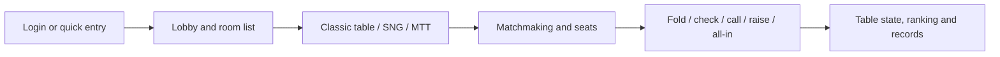

# Texas Holdem Source Code | C++ Callbacks, Poker Protocols, SNG and MTT

[Main README](README.md) · [简体中文](README.zh-CN.md) · [繁體中文](README.zh-TW.md) · [English product page](https://alibabama401.github.io/Texas-Holdem-Online-Poker-Platform/en/)

This repository publishes selected C++ callbacks, batch robot timing logic, poker protocol assets and product screenshots for a Texas Hold’em project. The public files are useful for protocol review, UI research and source-code evaluation.

> **Public scope:** This is not a complete buildable platform. Several required headers and service implementations are absent, the Unity files are scene metadata only, and the repository does not include a complete build system, database schema, service entry points or Unity scenes.

## Verifiable features

| Area | Public evidence |
|---|---|
| User and account data | `AsyncUserInfoCallback.*` profile, account and update callbacks |
| AI decisions | `AsyncAICalcResultCallback.*` room decision result callback |
| Robot dispatch | `AsyncPushRobotCallback.*` dispatch callback; most success handling is commented out |
| Batch robots | `BatchRobotTimer.*` configuration, entry, leave, expiry and re-entry checks |
| Login | Guest, device, account, third-party, quick and phone login message assets |
| Poker clubs | Create, join, member, application, invitation and exit messages |
| SNG and MTT | Match types, rooms, fees, repurchase and ranking reward fields |
| Texas Hold’em messages | Player, table, card, AI action and chip-related structures |

## Gameplay and product flow

## Product screenshots

| Online poker lobby | Classic Texas Hold’em table |
|---|---|
|  |  |
| **Table actions** | **Matchmaking and seating** |
|  |  |
| **MTT tournament** | **SNG tournament** |
|  |  |
| **Table presentation** | **Shop and props** |
|  |  |

## Repository map

| File | Purpose |
|---|---|
| `AsyncUserInfoCallback.cpp` | User profile and account callbacks |
| `AsyncAICalcResultCallback.cpp` | AI decision result callback |
| `AsyncPushRobotCallback.cpp` | Robot dispatch callback |
| `BatchRobotTimer.cpp` | Batch robot state and time checks |
| `Club.proto.bytes` | Poker club messages |
| `config.proto.bytes` | Room, SNG and MTT configuration messages |
| `dz.proto.bytes` | Texas Hold’em game messages |
| `docs/api_documentation.md` | API reference examples |
| `docs/deployment_guide.md` | Deployment reference examples |

## Known limitations

- The main success handler in `AsyncPushRobotCallback.cpp` is commented out.
- The central `onTimer()` loop in `BatchRobotTimer.cpp` is commented out.
- Protocol assets define messages; they are not server implementations.
- Unity `.meta` files do not contain the corresponding scenes or client project.
- API and deployment documents include example services and paths that require verification against the actual full project.
- `LICENSE` says MIT, while `License.md` and `CITATION.cff` contain different licensing descriptions. The maintainer should resolve this before reuse.

## Search terms

Texas Holdem source code, online poker source code, multiplayer poker, poker server, poker club, poker protocol, C++ game server, SNG tournament, MTT tournament, 德州扑克源码.

## Contact and responsible use

- Email: [ttpoker40@gmail.com](mailto:ttpoker40@gmail.com)
- Telegram: [@alibabama401](https://t.me/alibabama401)

Use this material for software evaluation, development research and lawful entertainment projects. Before deployment, review licensing, local gaming laws, age restrictions, privacy, payments, security and game fairness.
