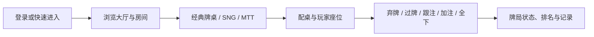

# 德州扑克源码与在线多人扑克平台｜Unity、C++、SNG 与 MTT

### Texas Hold’em Source Code and Online Poker Platform Reference

C++ 异步回调 · 扑克协议资源 · 经典牌桌 · 俱乐部 · SNG · MTT

[简体中文](README.zh-CN.md) · [台灣繁體](README.zh-TW.md) · [香港繁體](README.zh-HK.md) · [English](README.en.md) · [图文产品页](https://alibabama401.github.io/Texas-Holdem-Online-Poker-Platform/)

## 项目定位

本仓库提供德州扑克产品界面、协议资源和部分 C++ 服务代码，用于多人扑克项目的架构评估、协议研究、产品设计与二次开发参考。

当前公开源码包括用户信息与账户异步回调、房间 AI 决策回调、机器人推送回调、机器人批次时间管理，以及登录、大厅、俱乐部、游戏记录、配置、聊天和德州牌局等协议资源。仓库还包含八张 1280×720 左右的产品截图，展示大厅、经典牌桌、行动区、MTT、SNG、配桌和商城界面。

> **公开范围：** 这是源码片段与产品资料仓库，不是可直接编译部署的完整平台。C++ 文件引用了未公开的项目头文件和服务实现；Unity 仅有场景 `.meta`；未见完整构建配置、数据库脚本、服务入口或场景本体。

## 可核验功能

| 模块 | 仓库中的证据 |
|---|---|
| 用户资料与账户 | `AsyncUserInfoCallback.*` 包含基本资料、账户查询与变更回调 |
| 批次机器人 | `BatchRobotTimer.*` 包含批次配置、进入、离开、过期和重入检查 |
| 登录 | `login.proto.bytes` 含游客、设备、账号、第三方、快速和手机登录结构 |
| 俱乐部 | `Club.proto.bytes` 含创建、加入、成员、审核、邀请和退出消息 |
| SNG / MTT | `config.proto.bytes` 与 `CommonStruct.proto.bytes` 含赛事类型、房间、费用和奖励字段 |
| 德州牌局 | `dz.proto.bytes` 含玩家、牌局、AI 行动和筹码相关消息结构 |
| 大厅与道具 | `Hall.proto.bytes` 含道具、牌桌状态、通知和 AI 数据结构 |
| Unity 场景线索 | `Login.unity.meta`、`Hall.unity.meta`、`GamePlay3D.unity.meta` 等元数据 |

## 玩法与用户流程

截图与协议资源能够支持以下产品场景的界面和消息研究：

- 经典 Texas Hold’em 实时牌桌。
- SNG 单桌锦标赛与 MTT 多桌锦标赛。
- 俱乐部创建、加入、成员、申请和邀请消息流程。
- 大厅房间、配桌、座位、商城和道具入口。

## 产品截图

| 在线扑克大厅 | 经典德州牌桌 |
|---|---|
|  |  |
| **牌桌行动区** | **配桌与座位** |
|  |  |
| **MTT 多桌锦标赛** | **SNG 单桌锦标赛** |
|  |  |
| **牌桌视觉界面** | **商城与道具** |
|  |  |

## 技术组成

| 层级 | 当前公开内容 |
|---|---|
| C++ 回调层 | Tars 风格代理回调、日志、错误分支和部分业务状态处理 |
| 定时与机器人数据 | `Timer`、`BatchRobotTimer`、`BatchRobotDataDef` |
| 协议资源 | Protocol Buffers 风格的 `.proto.bytes` 文本资源 |
| Unity 资源线索 | 场景 `.meta` 文件，不含可打开的 `.unity` 场景 |
| 文档 | API 示例与部署参考；示例服务和路径需按实际工程验证 |
| 展示站点 | 三语 GitHub Pages、结构化数据、robots 和 sitemap |

## 仓库导航

| 文件 | 用途 |
|---|---|
| [`AsyncUserInfoCallback.cpp`](AsyncUserInfoCallback.cpp) | 用户资料与账户回调 |
| [`Club.proto.bytes`](Club.proto.bytes) | 俱乐部消息结构 |
| [`config.proto.bytes`](config.proto.bytes) | 房间、SNG、MTT 等配置结构 |
| [`dz.proto.bytes`](dz.proto.bytes) | 德州牌局消息结构 |
| [`docs/api_documentation.md`](docs/api_documentation.md) | API 参考文档 |
| [`docs/deployment_guide.md`](docs/deployment_guide.md) | 部署参考文档 |

## 评估步骤

1. 先通过截图确认产品形态和目标玩法。
2. 对照上表阅读 C++ 回调和协议资源，不只依据营销描述。
3. 列出缺失的头文件、服务实现、构建配置、数据库和 Unity 资源。
4. 向维护者取得完整交付清单、依赖版本、测试记录和授权说明。
5. 在隔离开发环境中完成编译、协议联调、安全审计和公平性测试。

## 已知限制

- `AsyncPushRobotCallback.cpp` 的主要成功处理逻辑目前被注释。
- `BatchRobotTimer.cpp` 的主 `onTimer()` 循环目前被注释。
- `.proto.bytes` 是消息资源，不等于服务端实现。
- `.unity.meta` 是 Unity 元数据，不等于场景或完整客户端。
- API 和部署文档包含示例地址、路径及服务名，需要结合实际工程核验。
- `LICENSE` 为 MIT，但 `License.md` 和 `CITATION.cff` 存在不同授权描述，使用前应由维护者统一。

## 搜索关键词

德州扑克源码、德州撲克原始碼、Texas Holdem source code、online poker source code、multiplayer poker、poker server、poker club、poker protocol、C++ game server、SNG tournament、MTT tournament。

## 联系与使用说明

- Email: [ttpoker40@gmail.com](mailto:ttpoker40@gmail.com)
- Telegram: [@alibabama401](https://t.me/alibabama401)

本仓库用于软件评估、开发研究和合法娱乐项目。部署或运营前，应确认所在地关于网络游戏、年龄限制、数据保护、支付和许可的法律要求，并完成安全与公平性审查。
